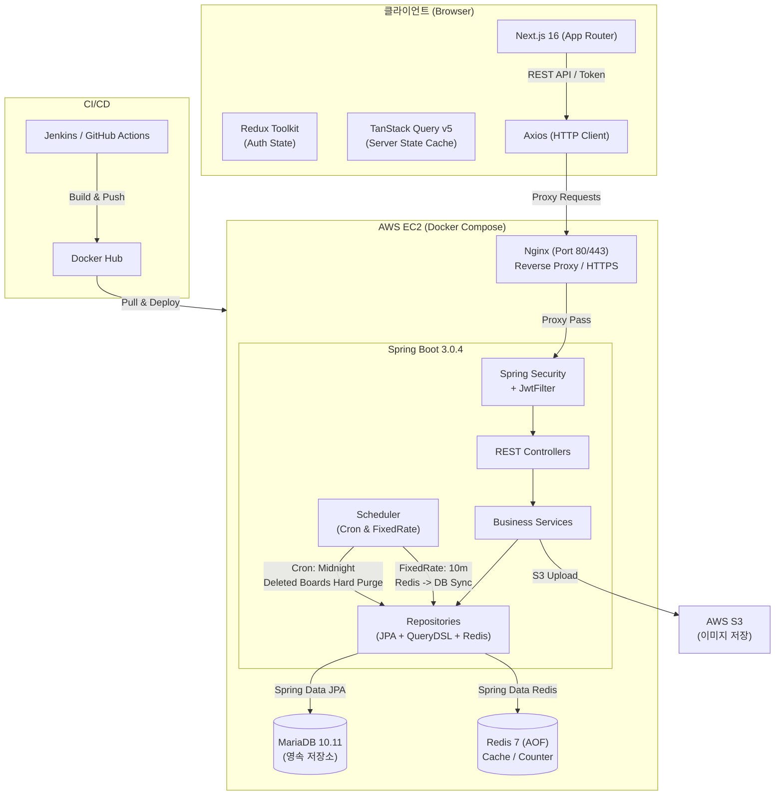
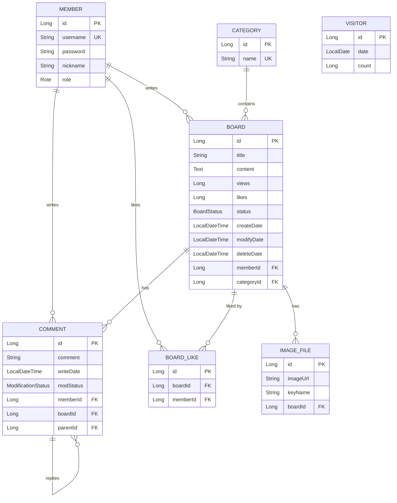
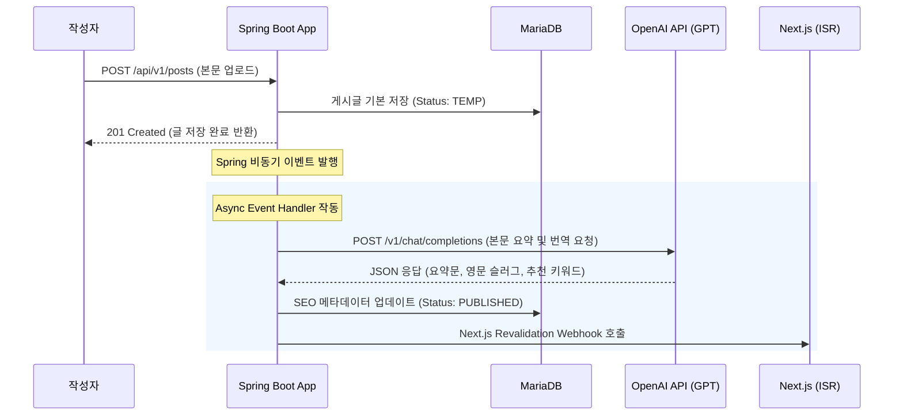

# MyBlog — 개인 블로그 플랫폼

단순히 게시글을 쓰고 읽는 CRUD 기능에 만족하지 않고, **"실무 환경에서 발생할 수 있는 장애, 성능 저하, 보안 위협을 어떻게 해결할 것인가"**에 집중하여 직접 설계하고 개선해 온 개인 블로그 플랫폼입니다.

수평 확장(Scale-out)이 가능한 **Stateless 아키텍처**, **Redis를 활용한 조회수·좋아요 동시성 제어 및 Write-Behind 캐싱**, **HMAC 서명 쿠키 기반 어뷰징 방지**, 그리고 **JPA N+1 쿼리 최적화**와 **Testcontainers 통합 테스트** 등을 고민하며 프로젝트의 완성도를 높였습니다.

또한 검색 엔진 유입을 늘리기 위해 **Next.js와의 긴밀한 연동을 고려한 백엔드 SEO(검색엔진 최적화) 인프라**까지 함께 고민하여 구축했습니다.

*   **Repository**: [github.com/gusm96/myblog-boot](https://github.com/gusm96/myblog-boot)
*   **개발 인원**: 1인 (요구사항 정의부터 DB 설계, 백엔드 아키텍처 개발, CI/CD 배포 및 운영 회고까지 전담)

---

## 1. 시스템 아키텍처 및 흐름



### 1.1 데이터베이스 구조 (ERD)



---

## 2. 주요 기술적 의사결정 및 해결 과정

### 2.1 JWT 기반 Stateless 인증·인가 설계
**도입 이유**  
세션(Session) 인증 방식은 수평 확장(Scale-out) 시 세션 동기화 비용이 발생하고, 유저가 늘어날수록 WAS 메모리 부담과 DB I/O 부하가 커집니다. 수평 확장에 유리하고 서버 부하가 적은 stateless한 방식을 취하기 위해 JWT를 도입했습니다.

**설계 방식**  
*   `OncePerRequestFilter`를 상속받은 `JwtFilter`를 구현하여 Spring Security 필터 체인 앞단에서 모든 요청 토큰을 검증합니다.
*   **Access Token(15분 만료)**은 클라이언트 메모리(Next.js Redux store)에 두어 보안을 높였고, **Refresh Token(2주 만료)**은 `HttpOnly` + `Secure` 옵션이 적용된 쿠키에 저장하여 XSS 공격 경로를 차단했습니다.
*   토큰이 만료되면 Axios Interceptor가 작동하여 클라이언트 모르게 토큰을 재발급(`GET /api/v1/reissuing-token`)받아 세션이 끊기지 않는 매끄러운 UX를 구현했습니다.

**트레이드오프**  
Stateless한 토큰의 단점은 '서버 측에서 강제로 탈취 토큰을 무효화(블랙리스트 처리)하기 어렵다'는 것입니다. Redis를 이용한 로그아웃 블랙리스트를 고민했으나, 블로그 도메인의 특성과 복잡도 증가 비용을 고려해 Access Token의 만료 시간을 15분으로 매우 짧게 가져가는 선에서 타협했습니다.

---

### 2.2 Redis 캐싱과 Write-Behind 패턴으로 조회수·좋아요 동시성 해결
**겪었던 문제 (JMeter 테스트 결과)**  
JMeter를 사용해 1,000건의 동시 요청을 10회 반복(총 10,000건) 보냈을 때, DB에 바로 `UPDATE`하는 비관적 락(`PESSIMISTIC_WRITE`) 방식은 락 대기가 폭증하여 응답이 지연되고 성능이 떨어졌습니다. (당시 처리량은 약 1,171 TPS, 평균 응답 789ms 수준)

**해결 방안**  
싱글 스레드로 작동해 원자성(Atomic)이 보장되는 Redis를 Write Buffer로 활용하여 DB 쓰기 병목을 우회했습니다.
*   **Lazy Loading**: 글 상세 조회 시 Redis 캐시(`BoardForRedis`)를 조회하고 없으면 DB에서 가져와 Redis에 적재합니다.
*   **In-Memory 카운팅**: 조회수와 좋아요 카운트는 DB가 아닌 Redis의 `INCR` 명령어를 사용하여 원자적으로 빠르게 처리합니다.
*   **Write-Behind**: 배치 스케줄러(`ScheduledTaskService`)가 10분마다 Redis의 변경 데이터를 모아서 MariaDB에 일괄 업데이트(Bulk UPDATE)를 날립니다.

**성능 개선 수치**  
JMeter를 이용해 1,000req × 10회 반복 테스트한 결과입니다.

| 버전 | 데이터 조회 및 갱신 방식 | 평균 응답 속도 | 처리량 (TPS) |
| --- | --- | --- | --- |
| **V2** | MariaDB 직접 읽기/쓰기 + 비관적 락 | 789 ms | 1,171.2 TPS |
| **V3** | **Redis In-Memory 캐시 + Write-Behind** | **174 ms** (78% 개선) | **4,882.8 TPS** (317% 향상) |

**트레이드오프**  
Write-Behind 방식은 DB 부하를 획기적으로 낮추지만, 스케줄 동기화 주기(10분) 사이에 Redis 서버가 불의의 사고로 유실되면 해당 시간 동안의 조회수와 좋아요 카운트가 유실될 리스크가 있습니다. 하지만 블로그의 조회수/좋아요는 금융 데이터처럼 즉각적인 일관성이 필수가 아니며, 고성능과 인프라 안정성이 더 중요하다고 판단하여 이 방식을 채택했습니다.

---

### 2.3 중복 조회 방지: Stateful Redis에서 Stateless HMAC 서명 쿠키로 고도화 (V5 → V7)
**기존 방식의 문제점 (V5)**  
처음에는 Redis에 중복 조회를 막기 위해 `visitor:{boardId}:{IP}` 형식으로 24시간 동안 IP를 저장했습니다. 하지만 이 방식은 공유 IP(NAT)를 쓰는 여러 유저가 동일한 기기로 오인받아 정상적인 조회수가 차단되는 오류가 있었고, 방문자와 글 수가 늘어남에 따라 Redis의 메모리가 끝없이 증가하는 부작용이 있었습니다.

**해결 방안 (V7)**  
서버의 비밀키(`visitor.hmac.secret`)를 이용해 `UUID + 날짜` 페이로드에 `HMAC-SHA256` 서명을 더한 암호화 서명 쿠키를 발행하는 방식으로 개선했습니다.
*   요청이 오면 서버는 쿠키의 서명을 재계산해 위변조 여부만 검증합니다.
*   쿠키 유효기간은 한국 시간(KST) 자정 기준으로 하루 동안 유지되며, 서명이 변조되었거나 날짜가 지나면 즉시 무효화됩니다.

**구현 코드 스니펫**
```java
// VisitorHmacService.java 중 서명 생성 부분
public String generateHmacCookieValue(String dateStr, String visitorUuid) {
    String payload = dateStr + ":" + visitorUuid;
    try {
        Mac mac = Mac.getInstance("HmacSHA256");
        SecretKeySpec secretKeySpec = new SecretKeySpec(
            hmacSecret.getBytes(StandardCharsets.UTF_8), "HmacSHA256"
        );
        mac.init(secretKeySpec);
        byte[] hash = mac.doFinal(payload.getBytes(StandardCharsets.UTF_8));
        String signature = Base64.getEncoder().encodeToString(hash);
        return payload + "." + signature;
    } catch (NoSuchAlgorithmException | InvalidKeyException e) {
        throw new BusinessException(ErrorCode.INTERNAL_SERVER_ERROR);
    }
}
```

**개선 결과**  
서버 측에서 어뷰징 방지 데이터를 들고 있을 필요가 없게 되면서 **중복 방지 목적의 Redis 메모리 사용량이 0으로 줄었습니다.** 또한 불필요한 분산 추적 로직 파일 6개를 삭제해 전체 백엔드 코드가 약 40% 슬림해졌습니다.

---

### 2.4 JPA N+1 문제 해결 및 Querydsl 동적 쿼리 튜닝
댓글 목록을 조회할 때 부모 댓글(Parent)과 대댓글(Child), 작성자(Member) 정보가 연관되어 있어 데이터 한 줄을 읽을 때마다 쿼리가 꼬리를 물고 나가는 **N+1 문제**를 발견했습니다.

*   **Fetch Join 도입**: `@Query`에 `LEFT JOIN FETCH`를 사용하여 부모 댓글과 대댓글, 필요한 엔티티들을 단 한 번의 쿼리로 다 가져오도록 레포지토리를 튜닝했습니다.
*   **Querydsl 5.0 적용**: 카테고리 필터링이나 검색 조건처럼 복잡한 동적 쿼리를 작성해야 할 때, 문자열로 쿼리를 조립하는 대신 컴파일 타임에 에러를 잡을 수 있고 자동완성이 지원되는 Querydsl을 적용하여 쿼리 작성 안정성을 높였습니다.

댓글 목록 조회 시 쿼리 발생 횟수를 **1+N번에서 단 1번으로 단축**시켜 응답의 지연 현상을 잡을 수 있었습니다.

---

### 2.5 Next.js ISR 캐시와 Spring Boot 비동기 Webhook 연동
블로그 로딩 속도를 높이기 위해 Next.js의 정적 페이지 캐싱(ISR)을 사용했지만, 글을 수정/삭제했을 때 실시간으로 화면에 보이지 않는 문제가 있었습니다.

이를 해결하기 위해 글 CUD가 성공하면 비동기적으로 이벤트를 발행하는 **Spring Events** 모델을 사용했습니다.
`RevalidateWebhookListener`가 비동기로 이벤트를 캐치해 Next.js의 캐시 리프레시 주소(`/api/revalidate`)를 호출합니다. 이로써 **백엔드 API 응답 속도에 영향을 주지 않으면서(비동기 처리)** 프론트엔드의 정적 페이지를 즉각 갱신(On-Demand Revalidation)할 수 있게 구현했습니다.

---

### 2.6 검색 엔진 최적화(SEO)를 위한 백엔드 데이터 공급망 구축
**도입 이유**  
기존 React SPA(CSR) 구조에서는 검색엔진 크롤러(특히 자바스크립트를 지원하지 않는 Naver Yeti 등)가 방문했을 때 빈 HTML 구조(`id="root"`)만 수집하여 본문 인덱싱과 노출이 불가능했습니다. 이를 차단하고자 Next.js 기반의 SSR/ISR 전환을 전제로, 백엔드 차원에서 검색 노출에 필요한 데이터 공급 아키텍처를 선제 구축했습니다.

**설계 및 구현**  
*   **Slug 시스템 도입**: `/posts/{id}` 형식의 숫자 ID 주소 체계를 검색엔진 노출 및 사용자 친화성(Semantic URL)에 유리한 한글/영어 타이틀 기반의 `/posts/{slug}` 체계로 변환했습니다. 이를 위해 Post 도메인 설계 단계부터 유니크한 슬러그 생성 및 조회 성능을 고려해 영속 계층을 재설계했습니다.
*   **RSS 2.0 XML 피드 직접 서빙**: Nginx 프록시 설정을 통해 `/rss.xml` 주소 요청을 백엔드가 가로채 직접 최신 50개 글에 대한 RSS 2.0 규격 XML 문서를 생성하여 제공합니다. 이를 통해 네이버 서치어드바이저 등이 신규 포스팅을 실시간으로 감지하도록 설계했습니다.
*   **Next.js 빌드 데이터 제공 API**: Next.js 빌드 타임의 정적 페이지 사전 생성(`generateStaticParams`) 및 `sitemap.xml` 생성을 지원하기 위해 전체 발행글의 Slug와 최종 수정일 목록을 효율적으로 반환하는 `/api/v1/posts/slugs` API를 제공합니다.
*   **API Cache-Control 헤더 세부 튜닝**: 크롤러들의 잦은 정보 수집 요청이 DB 병목으로 이어지지 않도록 API 엔드포인트별로 정밀한 HTTP 브라우저 캐싱(`Cache-Control`)을 다르게 세팅했습니다. (목록/상세 60초, 전체 슬러그 목록 1시간, RSS XML 피드 10분 캐시)

---

### 2.7 [Next Step] OpenAI API 도입을 통한 SEO 메타데이터 파이프라인 자동화 계획
**개선 배경**  
현재는 글 업로드 시 작성자가 수동으로 요약문(Meta Description)과 검색 키워드(Meta Keywords)를 입력하거나, 본문의 일부분을 단순히 잘라 쓰는 규칙을 사용합니다. 이는 검색 엔진 노출 시 가독성이 떨어지며 정교한 키워드 타겟팅에 한계가 있습니다. 이를 해결하기 위해 백엔드 파이프라인에 **OpenAI API(GPT-4o-mini 등)**를 연동하여 포스트 등록 시 메타데이터를 자동화할 계획입니다.

**주요 도입 방향 및 기대 효과**  
1.  **SEO 최적화 요약문(Meta Description) 자동 추출**: 작성자가 글을 등록하면 본문 컨텐츠의 핵심 맥락을 인공지능이 분석하여 검색 스니펫 기준(공백 포함 110~140자 내외)에 부합하고 클릭률(CTR)을 높일 수 있는 매끄러운 요약문을 자동 생성해 DB에 기록합니다.
2.  **검색 유입용 키워드(Meta Keywords) 및 태그 자동 분류**: 포스트 본문 내 주요 핵심 주제와 연관 키워드를 추출하여 태그와 메타 키워드를 자동으로 생성합니다. 이는 내부 링크 연결성을 강화하고 크롤러가 사이트를 깊게 탐색할 수 있는 통로를 만듭니다.
3.  **SEO 친화적 영문 슬러그(Slug) 자동 번역 및 요약**: 한글로 작성된 글의 제목을 그대로 URL 슬러그로 사용할 경우 인코딩 깨짐 현상이 일어납니다. OpenAI API를 활용해 한글 제목의 직관적 맥락을 유지하면서 검색어 매칭도가 높은 영문 URL 슬러그(예: `spring-boot-caching` 등)로 완전 자동 번역하여 서빙할 예정입니다.

**백엔드 비동기 아키텍처 구성안**  
외부 AI API 호출은 응답 대기 지연(API Latency 약 1~3초) 및 일시적인 API 에러 리스크가 존재합니다. 따라서 사용자 글 작성 API 처리 흐름 내에서 동기식으로 진행하지 않고, **Spring Events의 비동기 리스너(`@EventListener` + `@Async`)**를 바인딩할 계획입니다.



OpenAI API 장애 혹은 호출 한도 초과(Rate Limit) 등의 예외 발생에 대비하여, Spring `RetryTemplate`을 적용한 재시도 메커니즘을 두며, 최종 실패 시에는 제목 기반 영문 단순 치환 및 본문 앞자리 100자 복사본을 디폴트 폴백(Fallback) 값으로 적용해 안정성을 보장할 계획입니다.

---

## 3. 운영 인프라 및 문제 해결

### 3.1 Graceful Shutdown & Redis AOF로 데이터 정합성 보장
캐시 카운터를 도입한 후 서버가 예기치 않게 재시작되거나 배포될 때 Redis 메모리에만 있던 카운터 데이터가 유실되는 버그가 발생했습니다.
*   **데이터 백업**: Redis 설정을 **AOF(Append Only File)** 방식으로 켜두어 재시작 시 메모리 복원이 가능하게 했습니다.
*   **WAS Graceful Shutdown 연동**: WAS 컨테이너가 꺼지는 시점(`ContextClosedEvent` 수신)에 Redis에 쌓여 있던 조회수와 좋아요 데이터를 즉시 MariaDB에 동기화(Flush)하고 안전하게 다운되도록 설계해 무중단 배포 시 발생하던 데이터 유실 문제를 해결했습니다.

### 3.2 Testcontainers를 이용한 통합 테스트 환경 일원화
단위 테스트 과정에서 Mocking만으로는 Redis의 SCAN이나 TTL 정책, 데이터 직렬화 시 실제 데이터베이스에서 발생할 수 있는 잠재 버그들을 잡기 힘들었습니다.
*   이를 해결하고자 테스트 시점에 실제 Docker로 `redis:7-alpine` 컨테이너를 띄워 테스트를 진행하는 **Testcontainers v2.0.3**를 도입했습니다.
*   매 테스트 실행 시 Docker 컨테이너 생성 오버헤드로 테스트가 느려지는 현상을 막기 위해 **Singleton Container 패턴**을 구현하여 속도를 극대화했습니다. 99개의 비즈니스 로직 및 통합 테스트를 100% 통과하도록 구축했습니다.

---

## 4. 정량적 성과 요약

| 지표 | 개선 전 (V2 / Stateful) | 개선 후 (V3 / V7) | 성과 및 의의 |
| --- | --- | --- | --- |
| **게시글 조회수 갱신 속도** | 789 ms | **174 ms** | **78% 단축**으로 응답 병목 해결 |
| **게시글 조회 처리량** | 1,171 TPS | **4,882 TPS** | **317% 향상**으로 대용량 트래픽 대비 |
| **방문자 중복 체크용 Redis RAM** | O(방문자*글 수) | **0 Bytes** (Stateless 서명) | 인프라 메모리 비용 영구적 제거 |
| **통합/단위 테스트 성공률** | - | **99/99 통과 (0% 실패)** | 코드 배포 안정성 확보 |
| **REST Docs 생성 API 스니펫** | - | **333개 자동 생성** | 프론트엔드 협업용 문서 자동화 |

---

## 5. 학습 및 작업 습관

*   **기록 기반 설계**: 무작정 코딩을 시작하기보다는, 작업의 문제정의, 대안 기술 비교, 트레이드오프를 담은 계획서(`YYMMDD_*-plan.md` 시리즈)를 문서화한 뒤 작업을 진행했습니다. 프로젝트 내에 쌓인 약 60여 개의 마크다운 설계서는 저의 기술적 의사결정 발자취입니다.
*   **회고 지향 개발**: IP 기반 중복 체크의 단점을 발견하고 HMAC Stateless 서명으로 3차례에 걸쳐 리팩터링했듯이, 동작하는 것에 안주하지 않고 운영 단계에서 발생하는 리소스를 모니터링하며 지속적으로 개선하는 엔지니어링 과정을 지향합니다.
