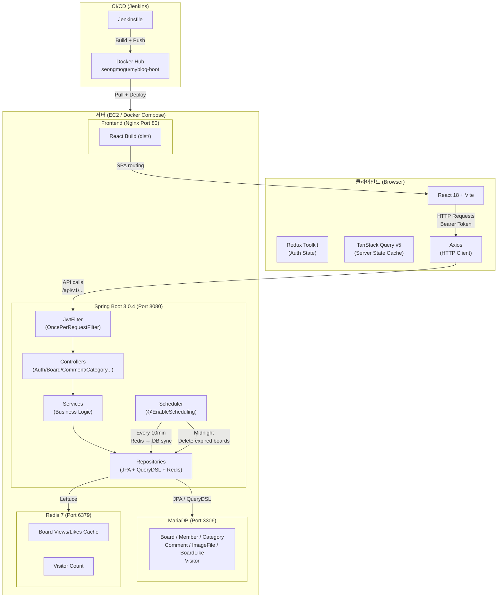
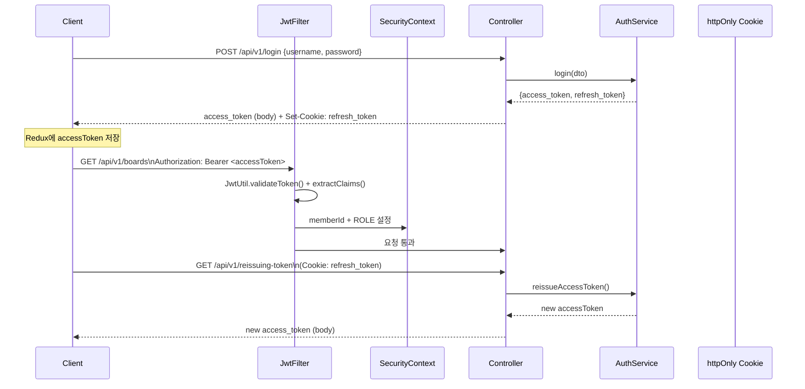
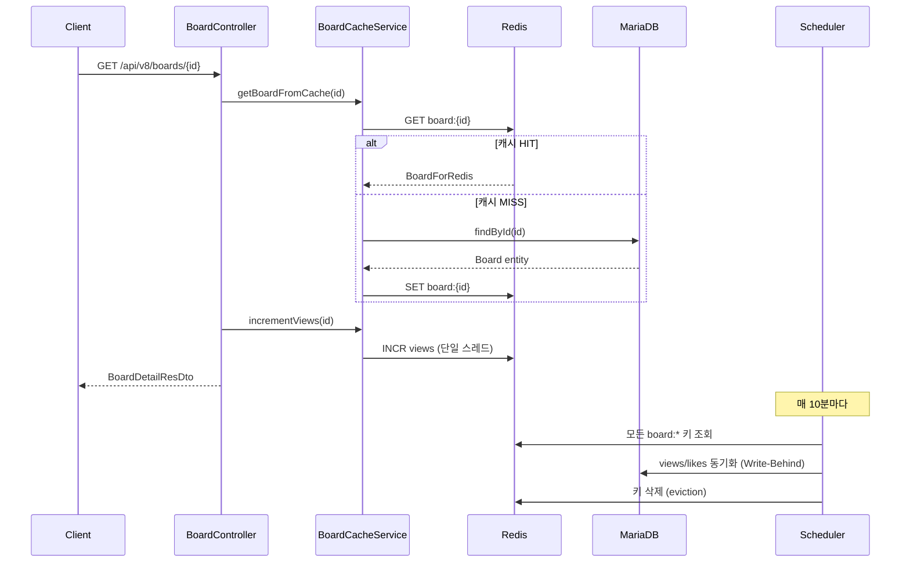
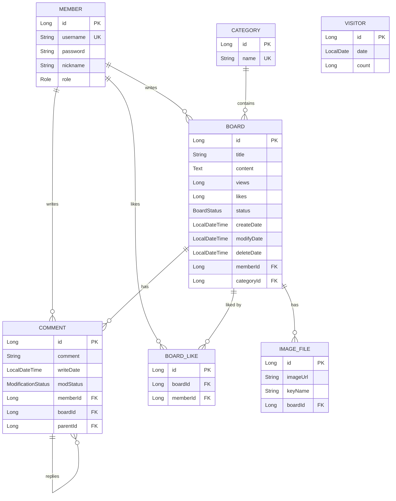
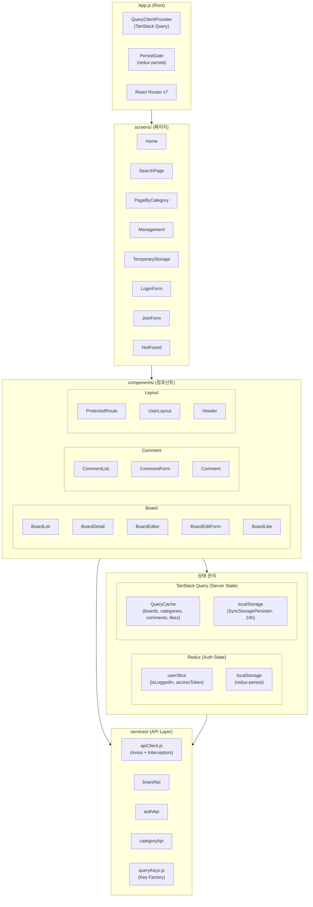
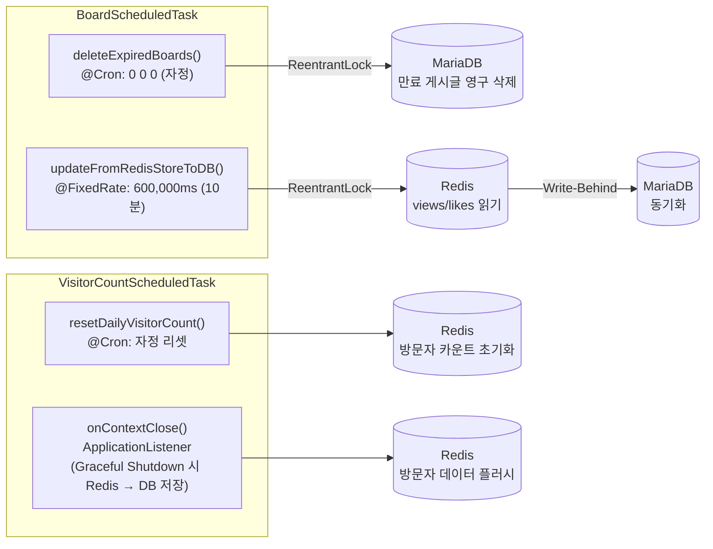
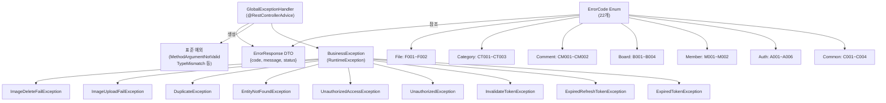

# MyBlog-Boot 전체 아키텍처 개요

> 작성일: 2026-04-04

---

## 1. 전체 시스템 구성도

---

## 2. 백엔드 레이어 아키텍처

```mermaid
graph LR
    subgraph Presentation["Presentation Layer"]
        AC[AuthController]
        BC[BoardController]
        BLC[BoardLikeController]
        DBC[DeletedBoardController]
        CC[CategoryController]
        CMC[CommentController]
        FUC[FileUploadController]
    end

    subgraph Service["Service Layer"]
        AS[AuthService]
        BS[BoardService]
        BCS[BoardCacheService]
        BLS[BoardLikeService]
        BVCS[BoardViewCookieService]
        CS[CategoryService]
        CMS[CommentService]
        FUS[FileUploadService]
        VCS[VisitorCountService]
        VHS[VisitorHmacService]
    end

    subgraph Repository["Repository Layer"]
        subgraph JPA["Spring Data JPA"]
            BR[BoardRepository]
            MR[MemberRepository]
            CR[CategoryRepository]
            CMR[CommentRepository]
            BLR[BoardLikeRepository]
            IFR[ImageFileRepository]
        end
        subgraph QueryDSL["QueryDSL"]
            BQR[BoardQuerydslRepository]
            CQR[CategoryQuerydslRepository]
            CMQR[CommentQuerydslRepository]
        end
        subgraph RedisRepo["Redis"]
            BRR[BoardRedisRepository]
            VCRR[VisitorCountRedisRepository]
        end
    end

    subgraph Domain["Domain / Entity"]
        Board & Member & Category & Comment & ImageFile & BoardLike & Visitor
    end

    Presentation --> Service
    Service --> Repository
    Repository --> Domain
```

---

## 3. 보안 / 인증 흐름

---

## 4. Redis 캐싱 전략 (Write-Behind 패턴)

---

## 5. 도메인 모델 (ERD)

---

## 6. 프론트엔드 아키텍처

---

## 7. 스케줄러 태스크

---

## 8. 예외 처리 체계

---

## 9. API 엔드포인트 요약

| Domain | Method | Endpoint | Auth | 설명 |
|--------|--------|----------|------|------|
| Auth | POST | `/api/v1/login` | 없음 | 로그인, 토큰 발급 |
| Auth | GET | `/api/v1/logout` | 없음 | 로그아웃, 쿠키 제거 |
| Auth | GET | `/api/v1/reissuing-token` | Cookie | Access Token 재발급 |
| Auth | GET | `/api/v1/token-validation` | 없음 | 토큰 유효성 확인 |
| Board | GET | `/api/v1/boards` | 없음 | 게시글 목록 (페이징) |
| Board | GET | `/api/v8/boards/{id}` | 없음 | 게시글 상세 (Cookie+HMAC 조회수) |
| Board | POST | `/api/v1/boards` | ADMIN | 게시글 작성 |
| Board | PUT | `/api/v1/boards/{id}` | ADMIN | 게시글 수정 |
| Board | DELETE | `/api/v1/boards/{id}` | ADMIN | 게시글 삭제 (soft) |
| Board | GET | `/api/v1/boards/search` | 없음 | 게시글 검색 |
| Board | GET | `/api/v1/boards/category` | 없음 | 카테고리별 게시글 |
| Like | GET | `/api/v2/likes/{boardId}` | USER | 좋아요 상태 조회 |
| Like | POST | `/api/v2/likes/{boardId}` | USER | 좋아요 추가 |
| Like | DELETE | `/api/v2/likes/{boardId}` | USER | 좋아요 취소 |
| Comment | GET | `/api/v1/comments/{boardId}` | 없음 | 댓글 목록 |
| Comment | POST | `/api/v1/comments` | USER | 댓글 작성 |
| Comment | PUT | `/api/v1/comments/{id}` | USER | 댓글 수정 |
| Comment | DELETE | `/api/v1/comments/{id}` | USER | 댓글 삭제 |
| Category | GET | `/api/v1/categories` | 없음 | 카테고리 목록 |
| Category | POST | `/api/v1/categories` | ADMIN | 카테고리 생성 |
| Category | PUT | `/api/v1/categories/{id}` | ADMIN | 카테고리 수정 |
| Category | DELETE | `/api/v1/categories/{id}` | ADMIN | 카테고리 삭제 |
| File | POST | `/api/v1/images` | ADMIN | 이미지 업로드 |
| File | DELETE | `/api/v1/images` | ADMIN | 이미지 삭제 |

---

## 10. 기술 스택 요약

| 영역 | 기술 | 버전 |
|------|------|------|
| Backend Framework | Spring Boot | 3.0.4 |
| Language | Java | 17 |
| ORM | Spring Data JPA + Hibernate | - |
| 동적 쿼리 | QueryDSL | 5.0 |
| DB | MariaDB | latest |
| Cache | Redis (Lettuce) | 7-alpine |
| Security | Spring Security + JWT (JJWT) | 0.12.6 |
| Build | Gradle | - |
| Test | JUnit 5 + Testcontainers | 2.0.3 |
| Frontend Framework | React | 18.2.0 |
| Bundler | Vite | 6.4.1 |
| Routing | React Router | 7.13 |
| 서버 상태 관리 | TanStack Query | 5.90 |
| 클라이언트 상태 | Redux Toolkit | 2.11.2 |
| HTTP Client | Axios | 1.13 |
| Rich Editor | TipTap | 3.20 |
| CSS-in-JS | Styled Components | 6.3 |
| CI/CD | Jenkins | - |
| Container | Docker + Docker Compose | - |
| Web Server | Nginx | - |
