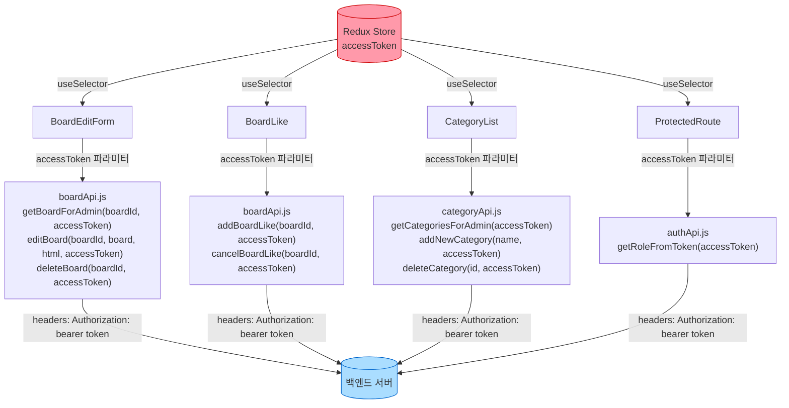
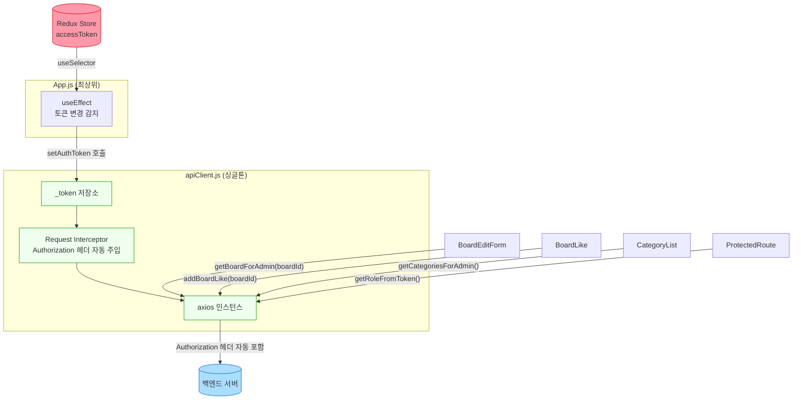
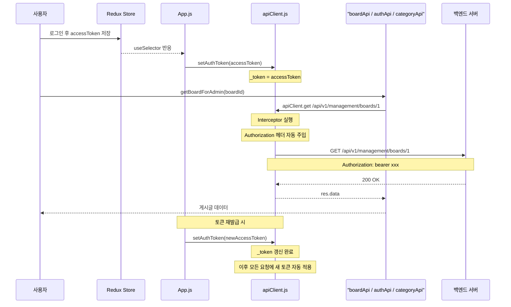

# Axios Interceptor 도입 — 플로우차트

## Before: 토큰을 각 컴포넌트에서 직접 전달

**문제점**
- `accessToken`이 Redux → 컴포넌트 → 함수 파라미터 → axios 헤더 경로로 매번 수동 전달
- 13개 컴포넌트 × N개 API 함수마다 `Authorization` 헤더 중복 작성
- 토큰 갱신 시 모든 호출부가 영향을 받음

---

## After: Interceptor가 토큰 주입 자동화

---

## 토큰 동기화 상세 흐름

